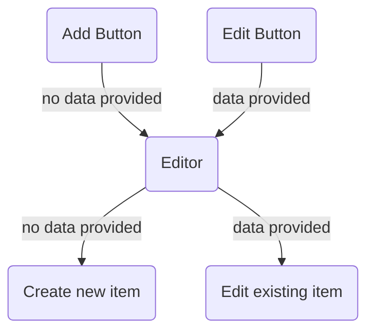

# :page_with_curl: Workspace page

In this page it is possible to manage the workspace configuration and create, edit and delete connectors, interceptors and forms. This page page are divided in three main blocks:

- **sidebar**: general workspace configuration and action buttons
- **container**
  - **connectors**: manage workspace's connectors
  - **forms**: manage workspace's forms

---

**Note**: Each block has its own file

After the first rendering of the page, all files necessary to run the workspace locally are created and stored on the file system, generating the following files and folders in the selected working directory:

- `/scimgateway`: scimgateway node project
- `/forms`: static website to handle with workspace's forms
- `docker-compose-yml`: file used to build and run docker containers

## :thinking: Understanding structure

### Sidebar (/layouts/workspace/sidebar)

The workspace's title and description cannot be edited, but you can change the container image name, working directory and the port on which the form page will be available after build. Note that any changes made to these fields **will not be saved in the database**.

The buttons located at the bottom of the sidebar allow you to control the status of Docker's containers. The first button will build both the Forms and the scimGateway images, while the second button will start or stop the execution of the containers.

In the application, the state `dockerStatus` controls the status of the buttons. The state options are:

- 0: image not built
- 1: image built and not running
- 2: image built running

The package `react-query` is used to fetch the request and get the initial status of `dockerStatus`.

### Connectors (/layouts/workspace/container/connector)

This layout is used to handle multiple connectors within a workspace, where each connector can have several interceptors (actions that are executed before reaching the connector). The `ReactFlow` package is being used to display all the connectors and their respective interceptors.

For more detailed information, please refer to the documentation available in the layots's folder.

### Forms (/layouts/workspace/container/forms)

This layout is used to manage multiple forms within a workspace, providing a way to interact with the API through a user interface (UI) with a custom request body.

For more detailed information, please refer to the documentation available in the layots's folder.

---

## :pencil: How add/edit logic works

The same component is used for creating or editing a **connector**. The only difference is whether a connector is **passed as a prop or not**. In other words, when the "add" button is clicked the function to open the form will be trigger with no previous data, but when it's triggered by clicking on the "edit" button, it will pass the connector information as props.

The same applies to the **interceptors** form logic.

Finally, after creating or editing an item, the API will be re fetched and the flow will be updated.

